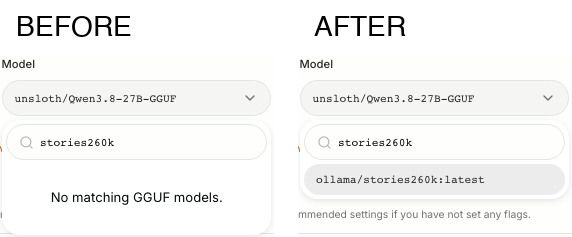

# PR #10763 UI evidence

Settings → Agents → Model, searching `stories260k` with one installed Ollama manifest.

- Before: PR merge base `d0dbe9059e`; zero matching UI rows and zero API models.
- After: approved head `5a9dcbf7a8`; one matching UI row and `ollama/stories260k:latest` in `/v1/models`.

[Full before](before.png) · [Full after](after.png) · [Measured facts and limitations](meta.json)

The screenshots come from separate source-built Studio instances with production UI,
API and authentication, isolated data roots, and the same small real GGUF fixture.
Only discovery roots are restricted by the harness. No API responses or UI contents
are substituted. This scene proves discovery, not inference. Offline Hub metadata
produces the same unrelated quantization warning visible in the full screenshots.
