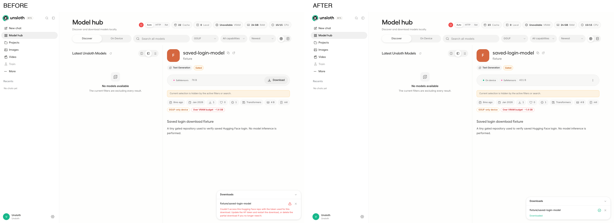

# PR #10758: saved Hugging Face login — browser evidence

Upstream: https://github.com/unslothai/unsloth/pull/10758

Before: `d0dbe9059efa443c6ad8bd1d51af7e2d9276a2bc` (PR merge base). After: `5ea4eb441760864a076bcc1255a329500ed8634b` (approved PR head).

Playwright clicked the real Studio Model hub **Download** button once on each side. Both browser POSTs to `/api/hub/download` had no explicit HF token. Both isolated HF homes had the same synthetic saved login. The actual backend and spawned download worker ran without source changes; only remote Hugging Face traffic used a loopback fixture, including browser metadata requests. No Studio API response was intercepted and no UI state was injected. Studio authentication and onboarding state were initialized for the scene.

| Measurement | Before | After |
| --- | --- | --- |
| Backend terminal state | error | complete |
| UI download tray | access failure | Downloaded |
| UI model status | Download button | On device |
| Files in completed snapshot | 0 | 3 |
| Downloaded snapshot bytes | 0 | 431 |
| Gated file HTTP 401 responses | 2 | 0 |
| Browser JavaScript errors | 0 | 0 |

The after snapshot matched all fixture bytes: config.json 147, model.safetensors 76, README.md 208. This verifies saved-login download behavior with a synthetic gated endpoint; it does not claim access to a real gated Hub account or model inference. Other visible hardware/cache badges are incidental, not assertions.

Browser: Chromium 151.0.7922.34, viewport 1440×1000, device scale 1, macOS. Separate exact-ref installs and HF caches, same scene and fixture. Six offline driver guards passed, facts and image bytes differed, and both originals and the labelled composite were visually inspected. Local execution; these screenshots were not produced by GitHub Actions. The separate cross-platform Actions runs are linked from the upstream evidence comment.



`meta.json` contains measured facts and PNG SHA-256 hashes. The fixture event files record only paths, methods, statuses, byte counts and authentication booleans, never credential values. Only sanitized screenshots, facts and harness source are published; no Studio homes, logs, browser storage, passwords or tokens from real accounts are included. The fixture token in the harness is synthetic and valid only for its own loopback server.

## Reproduction

Install the `pr-ui-evidence` and `pr-repro-ci` skills together under `~/.agents/skills`. Use Python with the suite dependencies and Playwright Chromium installed. Clone the upstream repository into `$UI_REPO` and choose fresh absolute `$UI_ROOT` and `$UI_WORKSPACE` directories.

```sh
UNSLOTH_WORKSPACE="$UI_WORKSPACE" UNSLOTH_NO_TORCH=1 UNSLOTH_SKIP_AUTOSTART=1 python ~/.agents/skills/pr-ui-evidence/scripts/pr_ui_prebuild.py --pr 10758 --repo "$UI_REPO" --root "$UI_ROOT"
UNSLOTH_WORKSPACE="$UI_WORKSPACE" PR_UI_PORT_BASE=9150 python harness/run_ui.py --pr 10758 --repo "$UI_REPO" --root "$UI_ROOT" --skip-install
```

The driver resolves the current PR refs and validates install stamps; compare them to the captured SHAs above. Use fresh homes when rerunning so completed downloads cannot carry over. The fixture launcher overrides only process environment and the remote Hub endpoint. The published harness removes one unused, unawaited no-op from the captured run and replaces the local skill path with `Path.home()`; neither changes the scene behavior. All owned Studio and fixture processes were stopped after capture.
