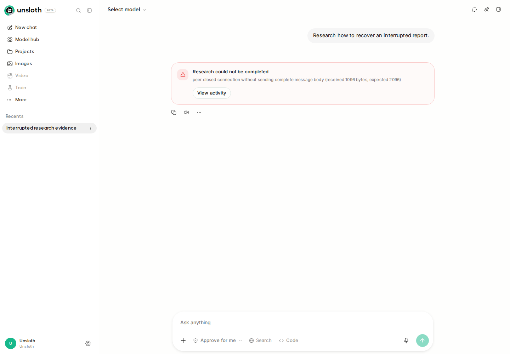
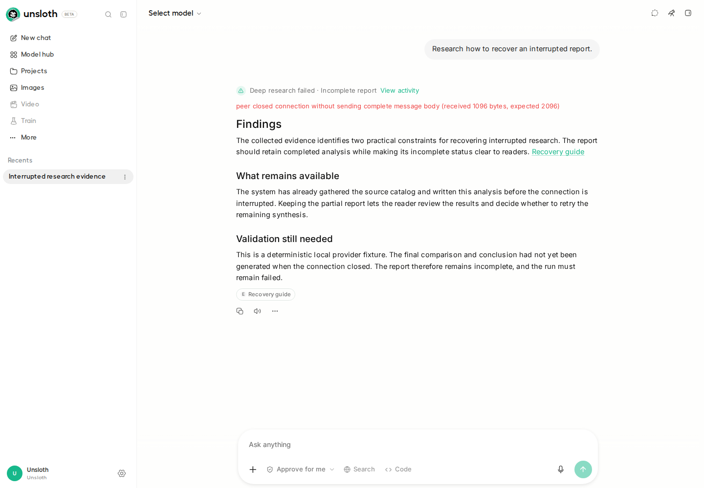

PR #10759 verification at `bb64dcf58896f1389300203641a0c372dfbb3e1e`, staged on upstream `e726fb1f563948fabde75f35fd745158c210f3e9`.

- All 517 research backend tests pass on Linux, macOS, and Windows. Reverted control: 4 expected failures, 513 passes on each OS.
- Full frontend suite: 7,284 tests pass, zero skips. TypeScript and production build pass.
- Added executable backend lines: 20/20 covered. Overall two-module coverage: 88.8% statements, 80.2% branches (86.6% combined).
- Chromium and Firefox: open activity, reload, reopen from Recents, read exact API report, verify every report paragraph/error/source/incomplete label in UI. No uncaught browser page errors.

| After reload and reopening | Fix reverted | Fix present |
| --- | --- | --- |
| Report characters | 0 | 755 |
| Sources retained in API | 1 | 1 |
| Status | failed | failed |
| Incomplete report visible | no | yes |
| Every report paragraph rendered | no | yes |

[Passing browser run](https://github.com/NilayYadav/unsloth/actions/runs/34537565869) · [Expected-failing browser control](https://github.com/NilayYadav/unsloth/actions/runs/34537565836)

Backend passing jobs: [Linux](https://github.com/NilayYadav/unsloth/actions/runs/34536811203/job/103070232652), [macOS](https://github.com/NilayYadav/unsloth/actions/runs/34536811203/job/103070232780), [Windows](https://github.com/NilayYadav/unsloth/actions/runs/34536811203/job/103070232778).

The harness uses real supervisor/HTTP SSE/SQLite/authenticated Studio code. Model output and source gathering are deterministic fixtures; the research run is finalized before browser navigation. These runs prove failed-report retention/display/activity/reopening, not real-model quality or a live streaming-to-failure browser transition.

The first Chromium capture raced deferred Markdown; the harness now waits for every paragraph and checks delayed-render/missing-report controls. Only the harness changed. One pre-existing negative macOS timing assertion passed on an unchanged job retry; the final negative results contain exactly the four report-loss failures. Full logs and test reports remain in the linked Actions artifacts for 30 days.

Before (Chromium):

After (Chromium):

Firefox: [before](before-firefox.png) · [after](after-firefox.png). Raw measured facts: [comparison.json](comparison.json). Full provenance and coverage limits: [provenance.json](provenance.json).
